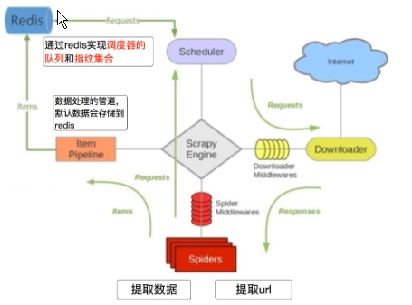

### 一、中间件的使用方法

**中间件的分类**

- 下载中间件
- 爬虫中间件

**中间件的作用**

主要作用是咋爬虫云心过程中进行一席而处理，如堆非200相应的重试(重新构建Request对象yield给引擎)

也可以对headers以及cookie积极性更换和处理

其他genuine月舞需求实现相应的功能

> 但是scrapy默认的情况下  两种中间件都在middlewares.py文件中
>
> 爬虫和下载中间件的使用是一样的，常用下砸中间件

**下载中间件的使用方法**

process_request(self,request,spider)

| 返回值      | 说明                                       |
| -------- | ---------------------------------------- |
| None     | 没有return 也是返回None, 该request对象传递给下载器，或通过引擎传递给其他权重低的precess_requet方法 |
| Response | 不在请求, 把response返回应给引擎                    |
| Request  | 该对象直接返回引擎交给调度器，此时讲不通过其他权重低的process_request方法 |

process_response(self,request,response,spider)

| 返回值      | 说明                           |
| -------- | ---------------------------- |
| Resposne | 通过引擎交给爬虫处理或交给权重较低的其他下载中间件的方法 |
| Request  | 通过引擎交给调度器继续请求，才是见个不通过其他权重低的  |
|          | 当下载器完成http请求，传递相应给引擎的时候调用    |

### 二、随机提user-agent

middlewares文件中导入setting的配置项

```
from Tencent.settings import USER_AGENTS_LIST
```

在setting中设置开启自定义的瞎子啊中间件，设置方法同管道

```python
DOWNLOADER_MIDDLEWARES = {
   'Tencent.middlewares.UserAgentMiddleware': 543, # 543是权重值
   'Tencent.middlewares.CheckUA': 600, # 先执行543权重的中间件，再执行600的中间件
}
```

在setting中添加UA列表

```python
USER_AGENTS_LIST = [
    "Mozilla/5.0 (compatible; MSIE 9.0; Windows NT 6.1; Win64; x64; Trident/5.0; .NET CLR 3.5.30729; .NET CLR 3.0.30729; .NET CLR 2.0.50727; Media Center PC 6.0)",
    "Mozilla/5.0 (compatible; MSIE 8.0; Windows NT 6.0; Trident/4.0; WOW64; Trident/4.0; SLCC2; .NET CLR 2.0.50727; .NET CLR 3.5.30729; .NET CLR 3.0.30729; .NET CLR 1.0.3705; .NET CLR 1.1.4322)",
    "Mozilla/4.0 (compatible; MSIE 7.0b; Windows NT 5.2; .NET CLR 1.1.4322; .NET CLR 2.0.50727; InfoPath.2; .NET CLR 3.0.04506.30)",
    "Mozilla/5.0 (Windows; U; Windows NT 5.1; zh-CN) AppleWebKit/523.15 (KHTML, like Gecko, Safari/419.3) Arora/0.3 (Change: 287 c9dfb30)",
    "Mozilla/5.0 (X11; U; Linux; en-US) AppleWebKit/527+ (KHTML, like Gecko, Safari/419.3) Arora/0.6",
    "Mozilla/5.0 (Windows; U; Windows NT 5.1; en-US; rv:1.8.1.2pre) Gecko/20070215 K-Ninja/2.1.1",
    "Mozilla/5.0 (Windows; U; Windows NT 5.1; zh-CN; rv:1.9) Gecko/20080705 Firefox/3.0 Kapiko/3.0",
    "Mozilla/5.0 (X11; Linux i686; U;) Gecko/20070322 Kazehakase/0.4.5"
]
```


### 三、scrapy代理ip

**思路分析**

1. 代理添加位置：request.meta中增加`proxy`字段
2. 获取一个代理`ip`，赋值给reques.meta['proxy']
   1. 代理池中随机选择代理`ip`
   2. 代理`ip`的`webapi`发送请求获取一个代理`ip`

**代码实现**

```python
# 人民币玩家的代码
import base64

# 代理隧道验证信息  这个是在那个网站上申请的
proxyServer = 'http://proxy.abuyun.com:9010' # 收费的代理ip服务器地址，这里是abuyun
proxyUser = 用户名
proxyPass = 密码
proxyAuth = "Basic " + base64.b64encode(proxyUser + ":" + proxyPass)

class ProxyMiddleware(object):
    def process_request(self, request, spider):
        # 设置代理
        request.meta["proxy"] = proxyServer
        # 设置认证
        request.headers["Proxy-Authorization"] = proxyAuth
```

**检测代理ip是否可用**

在使用代理ip的情况下可以在下载黄总监兼的process_response()方法中处理ip的使用情况，如果该代理ip不能是哟更可以提花昵称其他的代理ip

```python
def process_response(self, request, response, spider):
        if response.status != '200' and response.status != '302' and response.status != '301':
            #此时对代理ip进行操作，比如删除
            return request
```

### 四、selenium和scrapy的配合使用

```python
def getCookies():
    # 获取账号 密码

    user = input('账号输入:')
    pwd = input('密码输入:')

    # 实例化无界面模式的driver
    option = webdriver.ChromeOptions()
    option.add_argument('--headless')
    option.add_argument('--disable-gpu')

    driver = webdriver.Chrome('/home/worker/Desktop/spider_study/data/driver/chromedriver', chrome_options=option)

    # 模拟登录
    driver.get('https://github.com/login')

    driver.find_element_by_id('login_field').send_keys(user)
    driver.find_element_by_id('password').send_keys(pwd)

    driver.find_element_by_name('commit').click()

    # 获取并返回cookies
    cookies_list = driver.get_cookies()

    cookies_dict = {cookie['name']: cookie['value'] for cookie in cookies_list}

    driver.quit()
    return cookies_dict


class LoginMid():
    def process_request(self, request, spider):
        # 给request.cookies一个登录的cookie
        request.cookies = getCookies()

```


### 五、认识crawlspider爬虫类

> **能够匹配满足条件的url地址，组装成Reuqest对象后自动发送给引擎，同时能够指定callback函数**

**创建crawlspider的爬虫**

```scrapy genspider -t crawl tencent hr.tencent.com```

**rules的注意点**

1. rules是一个元组或者是列表，包含的是Rule对象
2. Rule表示规则，其中包含LinkExtractor,callback和follow等参数
3. LinkExtractor:连接提取器，可以通过正则或者是xpath来进行url地址的匹配
4. callback :表示经过连接提取器提取出来的url地址响应的回调函数，可以没有，没有表示响应不会进行回调函数的处理
5. follow：连接提取器提取的url地址对应的响应是否还会继续被rules中的规则进行提取，True表示会，Flase表示不会


### 六、crawlspider爬虫的代码实现

> 通过crawlspider爬取腾讯招聘的详情页的招聘信息
>
> url：[http://hr.tencent.com/position.php](http://hr.tencent.com/position.php)

**注意：**连接提取器LinkExtractor中的allow对应的正则表达式匹配的是href属性的值

**LinkExtractor的参数**

| 参数              | 说明                                       |
| --------------- | ---------------------------------------- |
| allow           | 满足括号中的're'表达式的url会被提取，如果为空，则全部匹配         |
| deny            | 满足括号中的're'表达式的url不会被提取，优先级高于allow        |
| allow_domains   | 会被提取的链接的domains(url范围)                   |
| restrict_xpaths | **使用xpath规则进行匹配，和allow共同过滤url，即xpath满足的范围内的url地址会被提取**， |

**Rule常见参数**

| 参数            | 说明                                       |
| ------------- | ---------------------------------------- |
| LinkExtractor | 链接提取器，可以通过正则或者是xpath来进行url地址的匹配          |
| callback      | 经过连接提取器提取出来的url地址响应的回调函数，可以没有，没有表示响应不会进行回调函数的处理 |
| follow        | 连接提取器提取的url地址对应的响应是否还会继续被rules中的规则进行提取，默认True表示会，Flase表示不会 |
| process_links | 当链接提取器LinkExtractor获取到链接列表的时候调用该参数指定的方法，这个自定义方法可以用来过滤url，且这个方法执行后才会执行callback指定的方法 |

### 七、crawlspider的注意事项

rules是一个元组或者是列表，包含的是Rule对象

Rule表示规则，其中包含LinkExtractor,callback和follow等参数

LinkExtractor:连接提取器，可以通过正则或者是xpath来进行url地址的匹配

callback :表示经过连接提取器提取出来的url地址响应的回调函数，可以没有，没有表示响应不会进行回调函数的处理

follow：连接提取器提取的url地址对应的响应是否还会继续被rules中的规则进行提取，True表示会，Flase表示不会

### 八、scrapy_redis的工作流程




1. 在scrapy_redis中，所有的带抓取的对象和去重的指纹都存在所有的服务器公用的redis中
2. 所有的服务器公用的一个redis中的request对象
3. 所有的request对象存入redis前，都会在同一个eredis中进行判断，之前是否已经存入过
4. 在默认情况下所有的数据会保存到redis当中