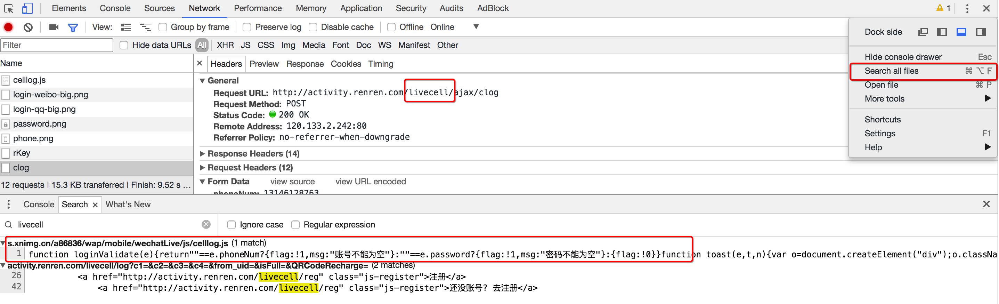
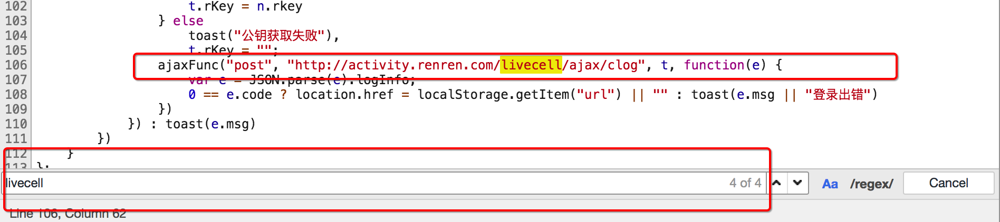

### 一、常见的反爬手段以及解决思路

反反爬的主要思路就是：**尽可能的去模拟浏览器，浏览器在如何操作，代码中就如何去实现**。

> 例如：浏览器先请求了地址url1，保留了cookie在本地，之后请求地址url2，带上了之前的cookie，代码中也可以这样去实现。

** 通过headers字段来反爬**

headers中有很多字段，这些字段都有可能会被对方服务器拿过来进行判断是否为爬虫

| User-Agent  | 请求之前添加User-Agent即可                      |
| ----------- | --------------------------------------- |
| **referer** | **添加referer字段(例如豆瓣美剧爬)**                |
| **cookie**  | 不登陆的，每次携带上次的cookie;登陆的，使用多个账号，装进cookie池 |

随机生成**User-Agent**

```python
def get_ua():
    first_num = random.randint(55, 62)
    third_num = random.randint(0, 3200)
    fourth_num = random.randint(0, 140)
    os_type = [
        '(Windows NT 6.1; WOW64)', '(Windows NT 10.0; WOW64)', '(X11; Linux x86_64)',
        '(Macintosh; Intel Mac OS X 10_12_6)'
    ]
    chrome_version = 'Chrome/{}.0.{}.{}'.format(first_num, third_num, fourth_num)

    ua = ' '.join(['Mozilla/5.0', random.choice(os_type), 'AppleWebKit/537.36',
                   '(KHTML, like Gecko)', chrome_version, 'Safari/537.36']
                  )
    return ua
```

**通过js反爬**

| **实现跳转**  | 在chrome中点击perserve log按钮实现观察页面跳转情况       |
| --------- | ---------------------------------------- |
| **请求参数**  | 分析js，观察加密的实现过程，通过js2py获取js的执行结果，或者使用selenium来实现 |
| **数据的加密** | 分析js，观察加密的实现过程，通过js2py获取js的执行结果，或者使用selenium来实现 |

**通过验证码来反爬**

| 原理     | 对方服务器通过弹出验证码强制验证用户浏览行为                   |
| ------ | ---------------------------------------- |
| **方法** | **打码平台或者是机器学习的方法识别验证码，其中打码平台廉价易用，更值得推荐** |

**通过ip地址反爬**

| 原理     | 同一个ip大量请求了对方服务器，识别为爬虫   |
| ------ | ----------------------- |
| **方法** | **通过购买高质量的ip的方式能够解决问题** |

**通过用户行为来反爬**

| 原理     | 通过浏览器请求数据，很多用户行为会在浏览器中是很容易实现或者无法实现. |
| ------ | ----------------------------------- |
| **方法** | **获取数据的情况来观察请求，寻找异常出现的可能请求**        |

**其他反爬**

| 方法    | 案例       | 方案       |
| ----- | -------- | -------- |
| 自定义字体 | 猫眼电影电脑版  | 切换到手机版   |
| css   | 猫眼去哪儿电脑版 | 计算css的偏移 |

### 二、了解打码平台

**常见打码平台**

1. 云打码：[http://www.yundama.com/](http://www.yundama.com/)

   能够解决通用的验证码识别

2. 极验验证码智能识别辅助：[http://jiyandoc.c2567.com/](http://jiyandoc.c2567.com/)

   能够解决复杂验证码的识别

### 三、使用chrome浏览器抓包

**新建隐身窗口**-->**network(Preserve log)**

### **四、js2py模块的使用**

**确定js的位置**

1. 观察按钮绑定的js事件


通过点击按钮，然后点击`Event Listener`，部分网站可以找到绑定的事件，对应的，只需要点击即可跳转到js的位置

2. 通过search来搜索

部分网站的按钮可能并没有绑定js事件监听，那么这个时候可以通过搜索请求中的关键字来找到js的位置，比如`livecell`




点击美化输出选项

可以继续在其中搜索关键字



**观察js的执行过程**

找到js的位置之后，我们可以来通过观察js的位置，找到js具体在如何执行，后续我们可以通过python程序来模拟js的执行，或者是使用类似`js2py`直接把js代码转化为python程序去执行

观察js的执行过程最简单的方式是添加断点

添加断点的方式：在左边行号点击即可添加，对应的右边BreakPoints中会出现现有的所有断点

添加断点之后继续点击登录，每次程序在断点位置都会停止，通过如果该行有变量产生，都会把变量的结果展示在Scoope中

在上图的右上角有1，2，3三个功能，分别表示：

```
- 1：继续执行到下一个断点
- 2：进入调用的函数中
- 3：从调用的函数中跳出来
```

**js2py的使用**

> js2py是一个js的翻译工具，也是一个通过纯python实现的js的解释器，[github上源码与示例](https://github.com/PiotrDabkowski/Js2Py)

1. 使用session发送rKey获取登录需要信息

   - url: [http://activity.renren.com/livecell/rKey](http://activity.renren.com/livecell/rKey)
   - 方法: get

2. 根据获取信息对密码进行加密 2.1 准备用户名和密码

   2.2 使用js2py生成js的执行环境:context

   2.3 拷贝使用到js文件的内容到本项目中

   2.4 读取js文件的内容,使用context来执行它们

   2.5 向context环境中添加需要数据

   2.6 使用context执行加密密码的js字符串

   2.7 通过context获取加密后密码信息

3. 使用session发送登录请求

   - URL: [http://activity.renren.com/livecell/ajax/clog](http://activity.renren.com/livecell/ajax/clog)

   - 请求方法: POST

   - 数据:

     ```
       phoneNum: xxxxxxx
       password: (加密后生产的)
       c1: 0
       rKey: rkey请求获取的
     ```